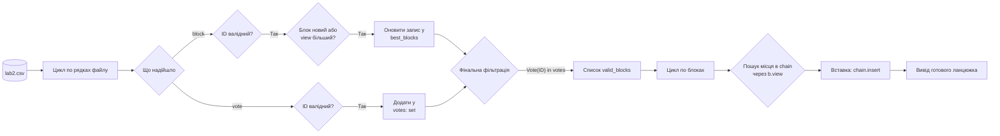
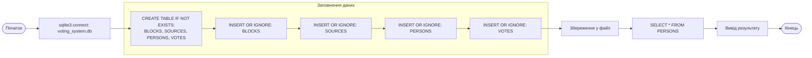
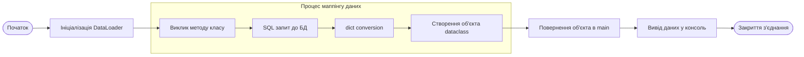
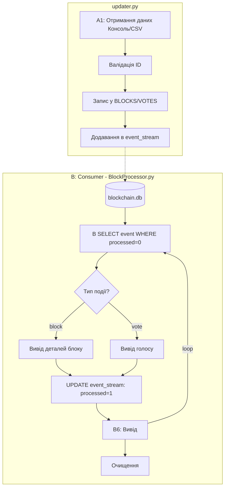

# Цикл лабораторних робіт (2-6) , що  реалізують BlockProcessor з SQL-бекендом.
## Структура проєкту:
* **lab2** - логіка обробки СVS- файлу для побудови ланцюжка блоків (Chain). Описуються класи Block  та Votes, відбувається валідація надійшовших данних та запис підходящих блоків до Chain, відсортованих за view
* **lab3** - створення структури власної бази даних (db). Наповнення бази даних.
* **lab4** - перенесення класів з 2 лабораторної роботи. Читається база даних, а її оброблені дані записуються до словників задля зручної подальшох роботи з інформацією. Текстовий вивід отриманих даних з таблиці.
* **lab5** - створення updater, який приймає та записує в окрему тимчасову базу даних інформацію з  CVS або з термінату. Ця база даних передається до BlockProcessor, який тепер обробляє безпосередньо db,  а не CVS.
* **lab6** - інтегрування бібліотеки pydantic у код 4 лабораторної роботи для автоматичної перевірки та типізації вхідних данних. Також створено окремий файл,  в якому описані тести (за допомгою pytest) до нашого коду.

### Схема lab2 


### Схема lab3

### Схема lab4

### Схема lab5


### Схема lab5
```mermaid
graph TD
    subgraph T [T: Етап тестування - pytest]
        T1[ DataLoader] --> T2[ Запуск тестів]
        T2 --> T3{T3: Валідація пройдена?}
        T3 -- No [ValidationError] --> T4[ Тест пройдено успішно]
        T3 -- Yes --> T5[ Тест пройдено успішно]
    end

    subgraph M [M: Основна програма - main.py]
        A([ Початок]) --> B[ Ініціалізація DataLoader]
        B --> C[ Виклик методу класу]
        C --> F[ SQL запит до БД]
        F --> G[ dict conversion]
        G --> H[ Створення об'єкта dataclass]
        H --> I[ Повернення об'єкта в main]
        I --> J[ Вивід даних у консоль]
        J --> K([ Закриття з'єднання])
        

    end

    T -.-> M
    K --> W([H: Кінець])

    %% Стилізація
    style T fill:#fce4ec,stroke:#880e4f,stroke-dasharray: 5 5
    style E fill:#e8f5e9,stroke:#2e7d32,stroke-width:2px
    style B fill:#e1f5fe,stroke:#01579b


    
